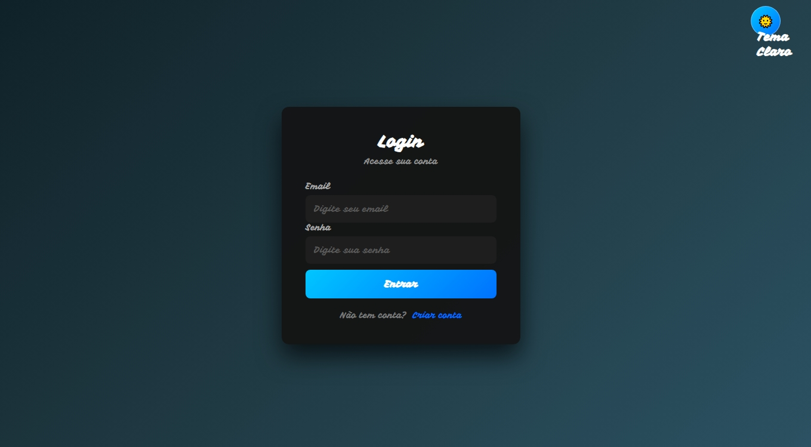
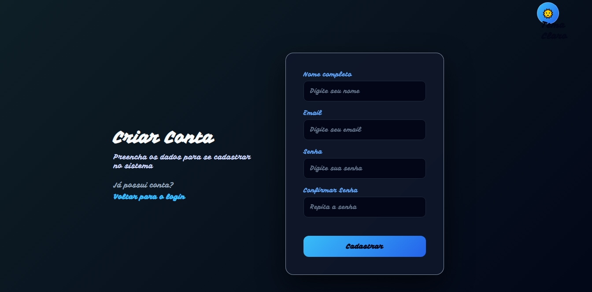
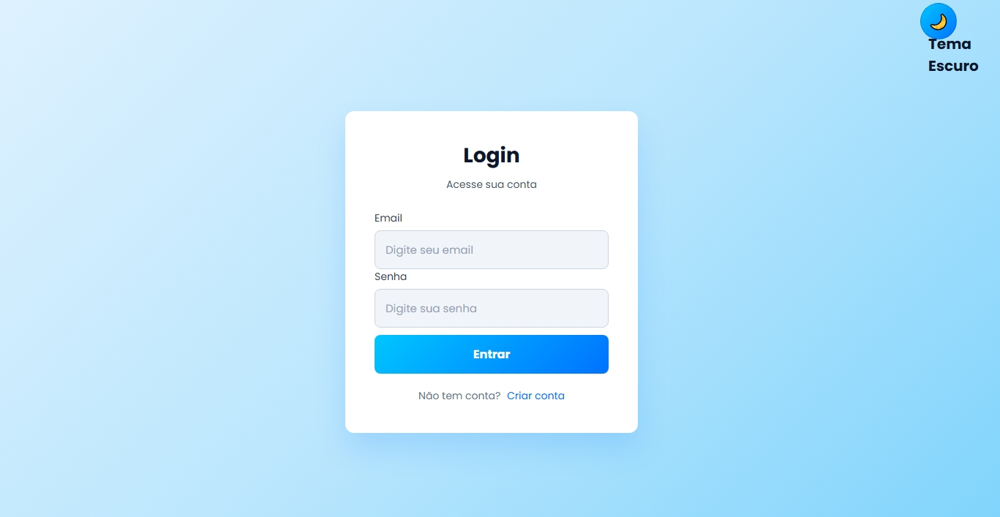
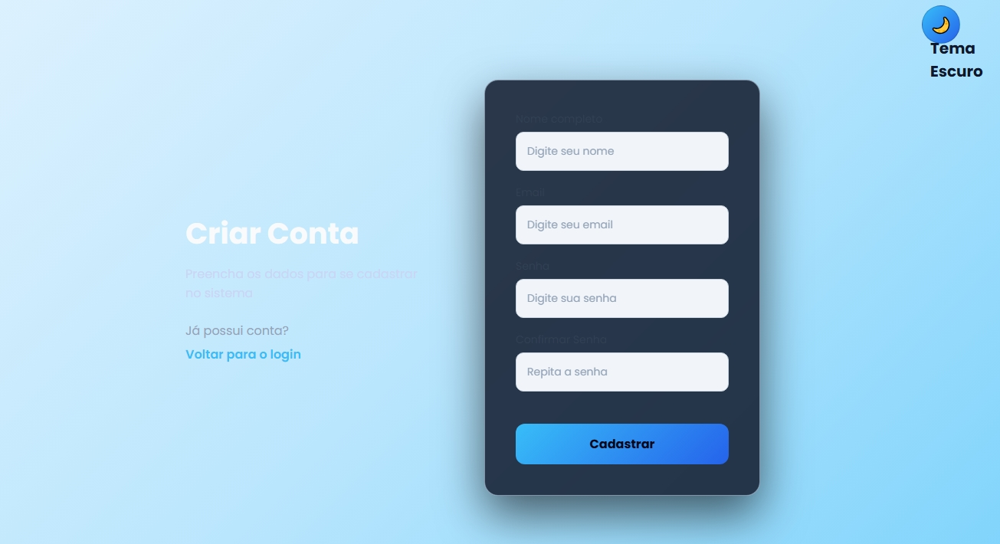
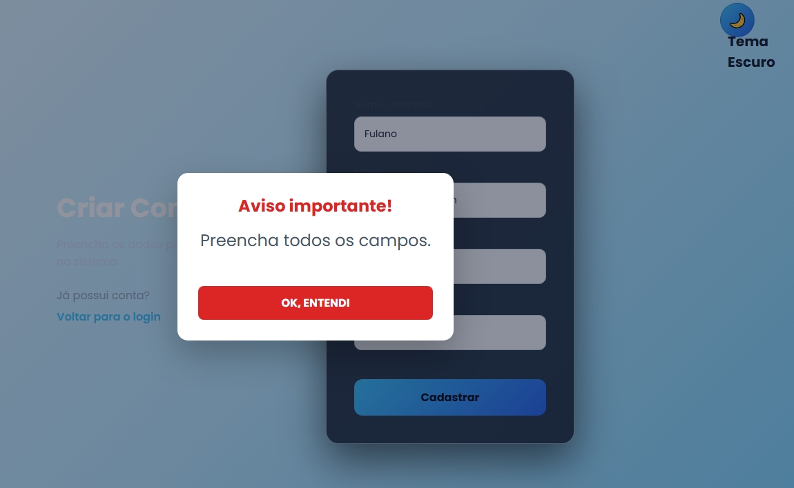
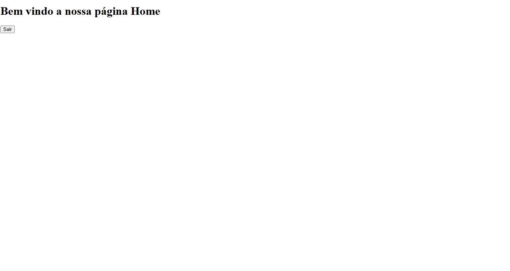

# Login System

## Sobre o projeto

O **Login System** é uma aplicação web desenvolvida para demonstrar um sistema de cadastro e autenticação de usuários.

O projeto permite realizar cadastro, login e validações de usuários, utilizando **HTML, CSS, JavaScript, Node.js e Express**. As senhas são protegidas com criptografia e a autenticação utiliza **JSON Web Token (JWT)**.

A aplicação também possui **tema claro e escuro**, sistema de notificações por **modal de mensagens**, armazenamento dos usuários em arquivo JSON e uma página inicial após o login.

**Curso de Ciências de Dados**

---

## Funcionalidades

- Cadastro de usuários
- Login de usuários
- Validação de formulários
- Validação de confirmação de senha
- Verificação de e-mail já cadastrado
- Criptografia de senhas
- Validação de e-mail e senha no login
- Autenticação utilizando JWT
- Armazenamento dos usuários em arquivo JSON
- Armazenamento do token de autenticação no navegador
- Botão **Sair** para remover o token armazenado
- Redirecionamento para a página de login após sair
- Tema claro
- Tema escuro
- Sistema de notificações
- Modal reutilizável para mensagens de sucesso e erro
- Mensagem de aviso quando o servidor estiver indisponível
- API REST
- Integração entre Front-End e Back-End

---

## Tecnologias

### Front-End

- HTML5
- CSS3
- JavaScript
- Google Fonts

### Back-End

- Node.js
- Express
- CORS
- bcryptjs
- JSON Web Token (JWT)
- fs-extra
- JSON para armazenamento dos usuários

---

## Estrutura do projeto

```text
Projeto_Login_System/
│
├── backend/
│   ├── database/
│   │   └── users.json
│   │
│   └── routers/
│       └── auth.js
│
├── frontend/
│   ├── CSS/
│   │   ├── style_register.css
│   │   └── styleDark.css
│   │
│   ├── JS/
│   │   ├── continuar.txt
│   │   ├── home.js
│   │   ├── login.js
│   │   ├── modal.js
│   │   ├── register.js
│   │   ├── script.js
│   │   └── theme.js
│   │
│   ├── home.html
│   ├── index.html
│   └── register.html
│
├── node_modules/
│
├── .gitignore
├── Atividades_de_Fixacao.txt
├── explicacao_ferramenta.txt
├── package-lock.json
├── package.json
├── README.md
└── server.js
```

---

## Organização das principais pastas

### `frontend/`

Contém os arquivos responsáveis pela interface da aplicação.

- `index.html` — página de login.
- `register.html` — página de cadastro.
- `home.html` — página inicial após o login.
- `CSS/` — arquivos responsáveis pela estilização das páginas.
- `JS/` — arquivos JavaScript responsáveis pelas funcionalidades da aplicação.

### `backend/`

Contém os arquivos responsáveis pelo servidor, pela API e pela autenticação.

- `database/users.json` — arquivo utilizado para armazenar os dados dos usuários.
- `routers/auth.js` — contém as rotas relacionadas ao cadastro e ao login.

### `server.js`

Responsável por iniciar o servidor Node.js/Express, configurar os recursos necessários e disponibilizar a aplicação.

---

# Como executar

## 1. Clonar o repositório

Clone o projeto utilizando o Git:

```bash
git clone URL_DO_REPOSITORIO
```

> Substitua `URL_DO_REPOSITORIO` pela URL do repositório do projeto no GitHub.

## 2. Entrar na pasta do projeto

```bash
cd Projeto_Login_System
```

## 3. Instalar as dependências

Execute:

```bash
npm install
```

Esse comando instala as dependências definidas no arquivo `package.json`.

## 4. Iniciar o servidor

Execute:

```bash
npm start
```

O servidor utiliza a porta:

```text
3001
```

## 5. Acessar a aplicação

Depois de iniciar o servidor, abra o navegador e acesse:

```text
http://localhost:3001
```

A página de login será carregada.

---

## Sistema de notificações e modal

O projeto possui um sistema de modal reutilizável localizado em:

```text
frontend/JS/modal.js
```

O modal substitui o uso do `alert()` tradicional do navegador e apresenta mensagens de forma padronizada.

As principais mensagens utilizadas são:

- **Cadastro realizado:** "Cadastro realizado com sucesso!"
- **E-mail já cadastrado:** "Email já cadastrado."
- **Senhas diferentes:** "As senhas não coincidem!"
- **Login realizado:** "Login realizado com sucesso."
- **E-mail inexistente:** "Email não cadastrado."
- **Senha incorreta:** "Senha inválida."
- **Servidor indisponível:** mensagem informando que não foi possível conectar ao servidor.

O modal possui:

- Título
- Mensagem
- Botão para fechar/confirmar
- Estilo visual para mensagens de sucesso
- Estilo visual para mensagens de erro
- Cores adaptadas ao tema claro ou escuro

---

## Autenticação

Após um login realizado com sucesso, o sistema recebe um **token JWT** do servidor.

Esse token é armazenado no `localStorage` do navegador para manter a autenticação durante a utilização da aplicação.

O botão **Sair** remove o token armazenado:

```javascript
localStorage.removeItem("token");
```

Depois disso, o usuário é redirecionado para a página de login.

---

## Temas

A aplicação possui dois temas:

- 🌙 Tema escuro
- ☀️ Tema claro

A alteração do tema é controlada pelo arquivo:

```text
frontend/JS/theme.js
```

Os estilos dos temas estão definidos nos arquivos CSS.

O sistema de modal também acompanha o tema selecionado, alterando as cores do fundo, textos e elementos visuais de acordo com o tema da página.

---

## Tratamento de servidor indisponível

As páginas de login e cadastro possuem tratamento de erro para situações em que o servidor não esteja disponível.

Quando não é possível estabelecer conexão com a API, o sistema apresenta uma mensagem utilizando o modal, evitando que o usuário receba apenas um erro no console ou uma mensagem padrão do navegador.

---

# Como utilizar

1. Acesse a página de cadastro em `register.html`.
2. Crie um usuário informando nome, e-mail, senha e confirmação da senha.
3. Após o cadastro, retorne para a página de login.
4. Informe o e-mail e a senha cadastrados.
5. Realize o login.
6. Após a autenticação, o sistema armazena o token JWT e direciona o usuário para a página principal.
7. Na página principal, utilize as funcionalidades disponíveis.
8. Utilize o botão de alteração de tema para alternar entre o modo claro e o modo escuro.
9. Para encerrar a sessão, utilize o botão **Sair**. O token será removido do navegador e o usuário retornará para a página de login.

---

# Demonstração visual

Esta seção apresenta as principais telas e funcionalidades visuais do projeto.
Todas as capturas de tela utilizadas nesta seção estão armazenadas na pasta:

docs/imagens/

### Tela de login



Página utilizada para realizar a autenticação do usuário.

### Tela de cadastro



Página utilizada para criar uma nova conta de usuário.

### Tema dark


Exemplo da aplicação utilizando o tema escuro.

### Tema light




Exemplo da aplicação utilizando o tema claro.

### Modal de sucesso


Exemplo de mensagem apresentada quando uma operação é realizada com sucesso.

### Modal de erro



Exemplo de mensagem apresentada quando ocorre algum erro ou validação não atendida.

### Página home



Página principal apresentada após o login realizado com sucesso.

---

## Fluxo da aplicação

```text
                    ┌──────────────────┐
                    │   index.html     │
                    │   Página Login   │
                    └────────┬─────────┘
                             │
                  ┌──────────┴──────────┐
                  │                     │
                Login               Cadastro
                  │                     │
                  ▼                     ▼
          ┌──────────────┐      ┌──────────────┐
          │  API Login   │      │ API Cadastro │
          └──────┬───────┘      └──────┬───────┘
                 │                     │
                 ▼                     ▼
          ┌──────────────┐      ┌──────────────┐
          │    JWT       │      │  users.json  │
          └──────┬───────┘      └──────────────┘
                 │
                 ▼
          ┌──────────────┐
          │  home.html   │
          │ Página inicial│
          └──────┬───────┘
                 │
                 ▼
              [ Sair ]
                 │
                 ▼
          Remove o token
                 │
                 ▼
            index.html
```

---

## API REST

O Back-End disponibiliza rotas para realizar as operações de autenticação e cadastro.

As requisições são realizadas pelo Front-End utilizando `fetch()` e comunicação no formato JSON.

O servidor da aplicação é executado localmente na porta:

```text
3001
```

---

## Autor

**Carlos Henrique Duarte**

**Curso Técnico em Ciências de Dados**  
**Escola do Futuro Paulo Renato de Souza**  
**Professor: Heraclides Mourão**

---

## Observações

Para utilizar o sistema corretamente, o servidor Node.js deve estar em execução.

Caso o servidor esteja desligado ou indisponível, as páginas de login e cadastro apresentam uma mensagem de erro através do modal.

O diretório `node_modules/` contém as dependências instaladas pelo npm e não precisa ser versionado no Git quando estiver configurado no `.gitignore`.
